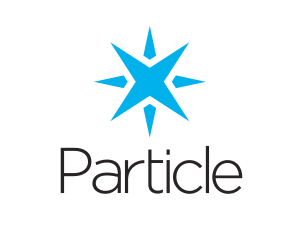

# Particle Tinker app for iOS

Install the Tinker app on your iOS device from the [App Store](https://apps.apple.com/us/app/particle-iot/id991459054)

Please visit [https://docs.particle.io/tutorials/developer-tools/tinker/xenon/](https://docs.particle.io/tutorials/developer-tools/tinker/xenon/) for more info about this app.

## Building app from the source code

The application code in this repo is stripped from private keys used by the application. To get the app to compile you either have to provide the missing keys or remove the references to these files and comment out the code that uses them. The missing files are:
1. `Keys.swift` from PhotonTinker folder
2. `GoogleService-Info.plist` from PhotonTinker folder

Use `Keys.template.swift` (located in root folder) as a template for `Keys.swift`. This file contains multiple keys:
1. `segmentAnalyticsWriteKey` - obtained from https://app.segment.com/ by creating an iOS app source and copying API write key.
2. `oAuthClientId` - obtained from [https://console.particle.io/authentication](https://console.particle.io/authentication).
3. `oAuthSecret` - obtained from [https://console.particle.io/authentication](https://console.particle.io/authentication).
3. `stripeKey` - obtained from [https://stripe.com/](https://stripe.com/).
3. `launchDarkly` - obtained from [https://launchdarkly.com/](https://launchdarkly.com/).

You can use `GoogleService-Info.template.plist` (located in root folder) as a template for `GoogleService-Info.plist`. Or you can obtain a genuine Google file by following [Firebase integration tutorial](https://firebase.google.com/docs/ios/setup).

This repo utilizes submodules. To load them, you have to run `git submodule init` and then `git submodule update --remote --merge`. Finally run `pod install` to load all Cocoapod dependencies. After all these steps app should compile and run.

### For maintainers

All of the above secrets can be found in private mobile assets repo that you will have access to if you are part of Particle organization.

## Contributors

- Raimundas Sakalauskas [Github](https://www.github.com/raimundassakalauskas)

## License

All code in this repository is available under the Apache License 2.0.  See the `LICENSE` file for the complete text of the license.
