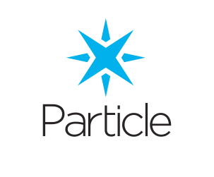

<p align="center">

</p>

# Particle Tinker app for iOS

Install the Tinker app on your iOS device from the [App Store](https://apps.apple.com/us/app/particle-iot/id991459054)

Please visit [https://docs.particle.io/tutorials/developer-tools/tinker/xenon/](https://docs.particle.io/tutorials/developer-tools/tinker/xenon/) for more info about this app.

## Building app from the source code

This repo utilises submodules. To load them, run `git submodule init` and then `git submodule update --remote --merge`. Then run `pod install` to load all CocoaPod dependencies (CocoaPods 1.16+; on a machine with a broken system Ruby, install it via `brew install cocoapods`). Open `Particle.xcworkspace` (not the `.xcodeproj`).

### App secret (`Keys.swift`)

The app reads its OAuth client credentials from `Keys.swift` in the **repo root**, which is **git-ignored** and must be created locally. Copy `Keys.template.swift` to `Keys.swift` (both in the root folder). The only values the app actually uses are:

1. `oAuthClientId` — the OAuth client id used to log in to the Particle Cloud.
2. `oAuthSecret` — the matching OAuth client secret.

**Where these come from:**

- **For local development / open-source builds:** you can use Particle's public client by setting both to `"particle"`. This is the same public client the CLI uses and is enough to sign in and exercise the app.
- **For a production / store build:** create a dedicated OAuth client at [https://console.particle.io/authentication](https://console.particle.io/authentication) and use its id/secret. Particle maintainers can instead pull the production credentials from the private **mobile assets** repo (you have access if you are part of the Particle organisation).

> The template still lists `segmentAnalyticsWriteKey`, `stripeKey`, `launchDarkly` and a `GoogleService-Info.plist`. These are **no longer used** — the analytics/crash/Firebase SDKs were removed during the 4.0 modernisation. You can leave the placeholder values as-is (or delete them); `GoogleService-Info.plist` is not required.

After these steps the app should compile and run in the simulator and on device.

## Releasing to TestFlight / the App Store

The app is signed with **automatic** signing against the Particle team (`TNJ67X9MQD`), bundle id `io.particle.Particle`. You need to be a member of the Particle Apple Developer team with permission to create signing certificates, and there must be an App Store Connect record for `io.particle.Particle`.

Archive and export an App Store-signed `.ipa`:

```sh
# 1. Archive (Release)
xcodebuild -workspace Particle.xcworkspace -scheme Particle -configuration Release \
  -destination 'generic/platform=iOS' -archivePath build/Particle.xcarchive \
  -allowProvisioningUpdates archive

# 2. Export an App Store .ipa (ExportOptions.plist uses method=app-store-connect, signingStyle=automatic)
xcodebuild -exportArchive -archivePath build/Particle.xcarchive \
  -exportOptionsPlist ExportOptions.plist -exportPath build/export \
  -allowProvisioningUpdates
```

### Upload credentials — where they come from

Uploading the `.ipa` to App Store Connect (which makes it available in TestFlight) requires App Store Connect credentials. These are **not** stored in this repo — generate your own using one of the two options below.

**Option A — App Store Connect API key (recommended for CLI/CI).** In [App Store Connect](https://appstoreconnect.apple.com) → **Users and Access → Integrations → App Store Connect API**, generate a key with at least the **App Manager** role. You get:
- a one-time-download `AuthKey_<KEY_ID>.p8` file — place it in `~/.appstoreconnect/private_keys/`,
- the **Key ID**,
- the **Issuer ID** (shown at the top of that page).

```sh
xcrun altool --upload-app -f build/export/Particle.ipa -t ios \
  --apiKey <KEY_ID> --apiIssuer <ISSUER_ID>
```

**Option B — app-specific password.** At [appleid.apple.com](https://appleid.apple.com) → **Sign-In and Security → App-Specific Passwords**, create a password for the Apple ID that is a member of the Particle team.

```sh
xcrun altool --upload-app -f build/export/Particle.ipa -t ios \
  --apple-id <your-apple-id-email> --team-id TNJ67X9MQD --password <app-specific-password>
```

You can also skip the CLI entirely and upload from **Xcode → Window → Organizer → Distribute App → TestFlight & App Store**, which prompts for the same credentials interactively.

> Maintainers: a shared App Store Connect API key for CI lives in the private **mobile assets** repo.

## Contributors

- Raimundas Sakalauskas [Github](https://www.github.com/raimundassakalauskas)

## License

All code in this repository is available under the Apache License 2.0.  See the `LICENSE` file for the complete text of the license.
